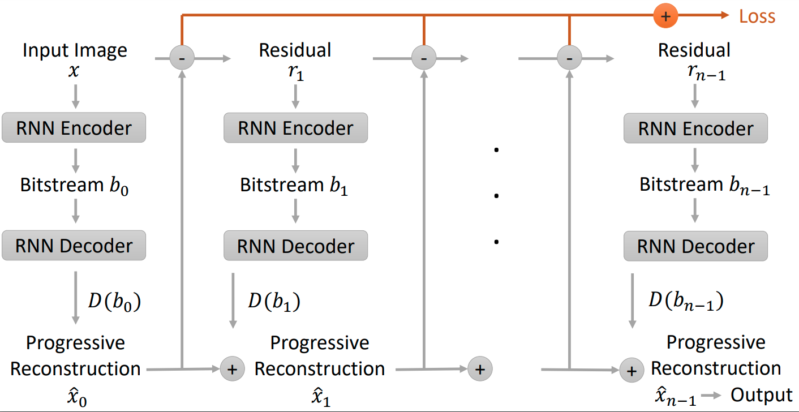
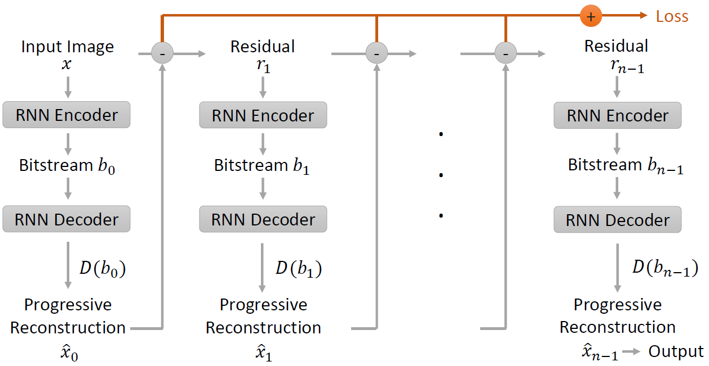
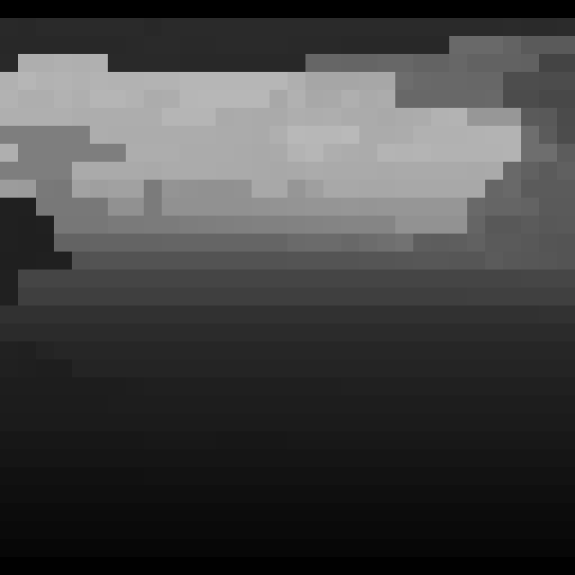
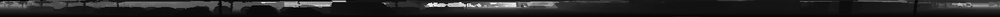
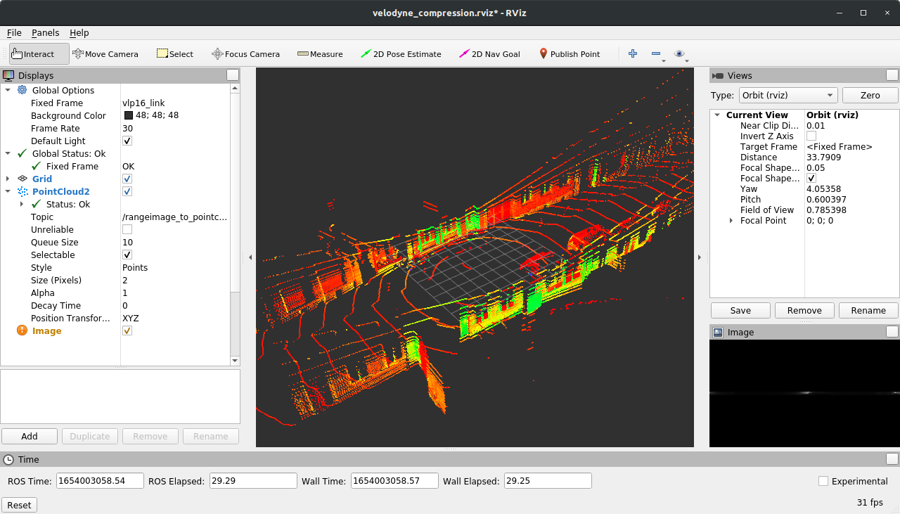

# 3D Point Cloud Compression with Recurrent Neural Network and Image Compression Methods

Reference implementation of the publication __3D Point Cloud Compression with Recurrent Neural Network
and Image Compression Methods__ published on the 33rd IEEE Intelligent Vehicles Symposium (IV 2022)
in Aachen, Germany.

This repository implements a RNN-based compression framework for range images implemented in Tensorflow 2.9.0.
Furthermore, it implements preprocessing and inference nodes for ROS Noetic in order to perform the compression
task on a `/points2` sensor data stream.

> **3D Point Cloud Compression with Recurrent Neural Network and Image Compression Methods**
> 
> [Till Beemelmanns](https://orcid.org/0000-0002-2129-4082),
> [Yuchen Tao](https://orcid.org/0000-0002-0357-0637),
> [Bastian Lampe](https://orcid.org/0000-0002-4414-6947),
> [Lennart Reiher](https://orcid.org/0000-0002-7309-164X),
> [Raphael van Kempen](https://orcid.org/0000-0001-5017-7494),
> [Timo Woopen](https://orcid.org/0000-0002-7177-181X),
> and [Lutz Eckstein](https://www.ika.rwth-aachen.de/en/institute/management/univ-prof-dr-ing-lutz-eckstein.html)  
> 
> [Institute for Automotive Engineering (ika), RWTH Aachen University](https://www.ika.rwth-aachen.de/en/)
> 
> _**Abstract**_ — Storing and transmitting LiDAR point cloud data is essential for many AV applications, such as training data
> collection, remote control, cloud services or SLAM. However, due to the sparsity and unordered structure of the data,
> it is difficult to compress point cloud data to a low volume. Transforming the raw point cloud data into a dense 2D
> matrix structure is a promising way for applying compression algorithms. We propose a new lossless and calibrated
> 3D-to-2D transformation which allows compression algorithms to efficiently exploit spatial correlations within the 
> 2D representation. To compress the structured representation, we use common image compression methods and also a 
> self-supervised deep compression approach using a recurrent neural network. We also rearrange the LiDAR’s intensity
> measurements to a dense 2D representation and propose a new metric to evaluate the compression performance of the
> intensity. Compared to approaches that are based on generic octree point cloud compression or based on raw point cloud
> data compression, our approach achieves the best quantitative and visual performance.

## Content
- [Approach](#approach)
- [Range Image Compression](#range-image-compression)
- [Model Training](#model-training)
- [Download of dataset, model weights and evaluation frames](#download-of-dataset-models-and-evaluation-frames)  
- [Inference & Evaluation Node](#inference--evaluation-node)
- [Authors of this Repository](#authors-of-this-repository)  
- [Cite](#cite)
- [Acknowledgement](#acknowledgement)

## Approach


## Range Image Compression
This learning framework serves the purpose of compressing range images projected from point clouds captured
by Velodyne LiDAR sensor. The network architectures are based on the work proposed by
[Toderici et al.](https://arxiv.org/pdf/1608.05148.pdf) and implemented in this 
repository using Tensorflow 2.9.0.


The following architectures are implemented:
- [__Additive LSTM__](range_image_compression/architectures/Additive_LSTM.py) - 
    Architecture that we used for the results in our paper.
- [__Additive LSTM Demo__](range_image_compression/architectures/Additive_LSTM_Demo.py) -
    Lightweight version of the Additive LSTM in order to test your setup 
- [__Additive GRU__](range_image_compression/architectures/Additive_GRU.py) - 
    Uses Gated Recurrent Units instead of a LSTM cell. We achieved slightly worse results
    compared to the LSTM variant
- [__Oneshot LSTM__](range_image_compression/architectures/Oneshot_LSTM.py) - 
    Does not use the additive reconstruction path in the network, as shown below.

The differences between the additive and the oneshot framework are visualized below.

#### Additive reconstruction framework
This reconstruction framework adds the previous progressive reconstruction to the current reconstruction.


#### Oneshot reconstruction framework
The current reconstruction is directly computed from the bitstream by the decoder RNN.


### Model Input - Output
The range representations are originally `(32, 1812)` single channel 16-bit images. During training, they are online
random cropped as `(32, 32)` image patches. The label is the input image patch itself. Note that during validation,
the random crop is performed offline to keep the validation set constant.

**Input:** 16-bit image patch of shape `(32, 1812, 1)` which will be random cropped to shape `(32, 32, 1)` 
during training.

**Output:** reconstructed 16-bit image patch of shape `(32, 32, 1)`.

| Input | Label | Prediction |
| --- | --- | --- |
|  |  |  |

During inference, the model can be applied to range image with any width and height divisible to 32, as the following 
example shows:

#### Input range image representation:
 

#### Predicted range image representation:
 


## Model Training

### Sample Dataset
A demo sample dataset can be found in `range_image_compression/demo_samples` in order to quickly test your 
environment.

### Dependencies
The implementation is based on *Tensorflow 2.9.0*. All necessary dependencies can be installed with
```bash
# /range_image_compression >$
pip install -r requirements.txt 
```

The architecture `Oneshot LSTM` uses GDN layers proposed by [Ballé et al.](https://arxiv.org/pdf/1511.06281.pdf),
which is supported in [TensorFlow Compression](https://github.com/tensorflow/compression). 
It can be installed with:
```bash
# /range_image_compression >$
pip3 install tensorflow-compression==2.9.0
```

### Run Training
A training with the lightweight demo network using the sample dataset can be started with the
following command:
```bash
# /range_image_compression >$
python3 ./train.py \
        --train_data_dir="demo_samples/training" \
        --val_data_dir="demo_samples/validation" \
        --train_output_dir="output" \
        --model=additive_lstm_demo
```
If you downloaded the whole dataset (see below) then you would have to adapt the values for `--train_data_dir` and
`--val_data_dir` accordingly.

### Run Training with Docker
We also provide a docker environment to train the model. First build the docker image and then start the
training:
```bash
# /docker >$
./docker_build.sh
./docker_train.sh
```


## Configuration
Parameters for the training can be set up in the configurations located in the directory 
[range_image_compression/configs](range_image_compression/configs). It is recommended to use a potent multi-gpu setup 
for efficient training.

### Learning Rate Schedule
The following cosine learning rate scheduler is used:

*(1+cos((e-e_{max})/(e_{min}-e_{max})*\pi)))

| Parameter | Description | Example |
| --- | --- | --- |
| `init_learning_rate` | initial learning rate | `2e-3` |
| `min_learning_rate` | minimum learning rate | `1e-7` |
| `max_learning_rate_epoch` | epoch where learning rate begins to decrease | `0` |
| `min_learning_rate_epoch` | epoch of minimum learning rate | `3000` |

### Network Architecture
Default parameters for the network architectures

| Parameter | Description | Example |
| --- | --- | --- |
| `bottleneck` | bottleneck size of architecture | `32` |
| `num_iters` | maximum number of iterations | `32` |

### Model Zoo
| Model Architecture | Filename                              | Batch Size | Validation MAE | Evaluation SNNRMSE `iter=32` |
|--------------------|---------------------------------------|------------|----------------|------------------------------|
| Additive LSTM      | `additive_lstm_32b_32iter.hdf5`       | 32         | `2.6e-04`      | `0.03473`                    |
| Additive LSTM Slim | `additive_lstm_128b_32iter_slim.hdf5` | 128        | `2.3e-04`      | `0.03636`                    |
| Additive LSTM Demo | `additive_lstm_128b_32iter_demo.hdf5` | 128        | `2.9e-04`      | `0.09762`                    |
| Oneshot LSTM       | `oneshot_lstm_b128_32iter.hdf5`       | 128        | `2.9e-04`      | `0.05137`                    |
| Additive GRU       | Will be uploaded soon                 | TBD        | TBD            | TBD                          |

## Download of Dataset, Models and Evaluation Frames
The dataset to train the range image compression framework can be retrieved by filling out the following form
[https://www.unicaragil.de/de/point-cloud-compression](https://www.unicaragil.de/de/point-cloud-compression).
After filling out the form, you will obtain a link where you can download the following files

- __`pointcloud_compression.zip`__ (1.8 GB): ZIP File which contains three directories
    - `train`: 30813 range images for training
    - `val`: 6162 cropped `32 x 32` range images for validation
    - `test`: 1217 range images for testing
- __`evaluation_frames.bag`__ (17.6 MB): ROS bag which contains the Velodyne package data in order to evaluate the model.
  Frames in this bag file were not used for training nor for validation.
- __`additive_lstm_32b_32iter.hdf5`__ (271 MB): Trained model with a bottleneck size of 32
- __`additive_lstm_128b_32iter_slim.hdf5`__ (67.9 MB): Trained model with a bottleneck size of 32
- __`oneshot_lstm_b128_32iter.hdf5`__ (68.1 MB): Trained model with a bottleneck size of 32
- __`additive_lstm_256b_32iter_demo.hdf5`__ (14.3 MB): Trained model with a bottleneck sizeof 32

## Inference & Evaluation Node
The inference and evaluation is conducted with ROS. The inferences and preprocessing nodes can be found
under [catkin_ws/src](catkin_ws/src). The idea is to use recorded Velodyne package data which are stored in a `.bag` 
file. This bag file is then played with `rosbag play` and the preprocessing and inference nodes are applied to this raw
sensor data stream. In order to run the inference and evaluation you will need to execute the following steps.

### 1. Initialize Velodyne Driver
To run the evaluation code we need to clone the Velodyne Driver from the [official repository](https://github.com/ros-drivers/velodyne). 
The driver is integrated as a submodule to [catkin_ws/src/velodyne](catkin_ws/src/velodyne). You can initialize the
submodule with:
```bash
git submodule init
git submodule update
```

### 2. Pull Docker Image
We provide a docker image which contains ROS Noetic and Tensorflow in order to execute the inference and evaluation
nodes. You can pull this dockerfile from [Docker Hub](https://hub.docker.com/r/tillbeemelmanns/pointcloud_compression)
with the command:
```bash
docker pull tillbeemelmanns/pointcloud_compression:noetic
```

### 3. Download Weights
Download the model's weights as `.hdf5` from the download link and copy this file to `catkin_ws/models`. Then, in the 
[configuration file](catkin_ws/src/pointcloud_to_rangeimage/params/pointcloud_to_rangeimage.yaml) insert the 
correct path for the parameter `weights_path`. Note, that we will later mount the directory `catkin_ws` into 
the docker container to `/catkin_ws`. Hence, the path will start with `/catkin_ws`.

### 4. Download ROS Bag
Perform the same procedure with the bag file. Copy the bag file into `catkin_ws/rosbags`. The filename should be
`evaluation_frames.bag`. This bag file will be used in this [launch file](catkin_ws/src/pointcloud_to_rangeimage/launch/compression.launch).


### 5. Start Docker Container
Start the docker container using the script
```bash
# /docker >$
./docker_eval.sh
```
Calling this script for the first time will just start the container. 
Then open a second terminal and execute `./docker_eval.sh` script again in order to open the container with bash. 
```bash
# /docker >$
./docker_eval.sh
```

### 6. Build & Execute
Run the following commands inside the container to build and launch the compression framework.
```bash
# /catkin_ws >$
catkin build
source devel/setup.bash
roslaunch pointcloud_to_rangeimage compression.launch
```

You should see the following RVIZ window which visualizes the reconstructed point cloud.


### 7. GPU Inference
In case you have a capable GPU, try to change line 44 in [docker_eval.sh](docker/docker_eval.sh) and define your GPU ID
with flag `-g`

```sh
$DIR/run-ros.sh -g 0 $@
```

## Authors of this Repository
[Till Beemelmanns](https://github.com/TillBeemelmanns) and [Yuchen Tao](https://orcid.org/0000-0002-0357-0637)


Mail: `till.beemelmanns (at) rwth-aachen.de`

Mail: `yuchen.tao (at) rwth-aachen.de`

## Cite

```
@INPROCEEDINGS{9827270,
  author={Beemelmanns, Till and Tao, Yuchen and Lampe, Bastian and Reiher, Lennart and Kempen, Raphael van and Woopen, Timo and Eckstein, Lutz},
  booktitle={2022 IEEE Intelligent Vehicles Symposium (IV)}, 
  title={3D Point Cloud Compression with Recurrent Neural Network and Image Compression Methods}, 
  year={2022},
  volume={},
  number={},
  pages={345-351},
  doi={10.1109/IV51971.2022.9827270}}
```

## Acknowledgement

>This research is accomplished within the project ”UNICARagil” (FKZ 16EMO0284K). We acknowledge the financial support for
>the project by the Federal Ministry of Education and Research of Germany (BMBF).