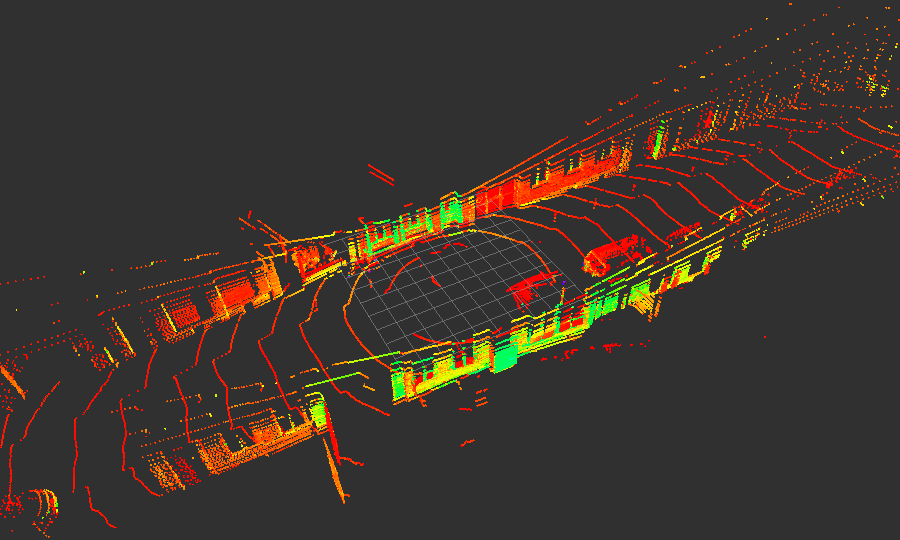
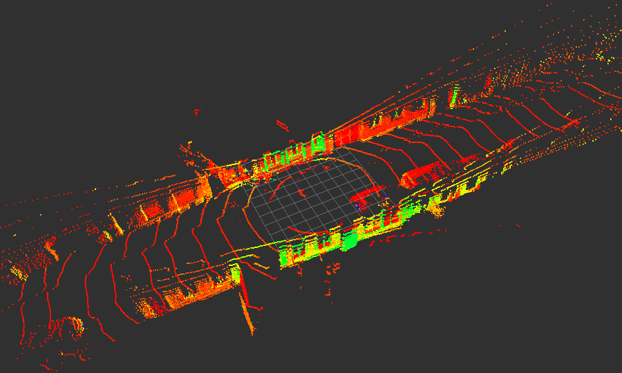

## RNN Based Point Cloud Compression

The idea is to losslessly convert  a point cloud to range, azimuth and intensity images,
then compress them using image compression methods.

| Input Point Cloud | Decompressed Point Cloud |
| --- | --- |
|  |  |


### Configuration

Initial settings of the Velodyne LiDAR sensor and parameters of the application can be set int the configuration file
[pointcloud_to_rangeimage.yaml](params/pointcloud_to_rangeimage.yaml).
Default setting is based on Velodyne VLP-32C model.

### point_cloud_to_rangeimage

Parameter | Description | Example
------------ | ------------- | -------------
vlp_rpm | RPM of the sensor | `600.0`
num_layers | Number of laser layers in the sensor | `32`
firing_circle | Time for one firing circle | `0.000055296`
elevation_offsets | Elevation angle corresponding to each laser layer in ascending order | `see default setting`
azimuth_offsets | Azimuth offset corresponding to each laser layer with the same order as elevation_offsets | `see default setting`
record_images | Whether to record transformed images in a local folder | `false`
record_path | Path to store lidar compression dataset | `/home/rosuser/catkin_ws/dataset/`
threshold | Maximum range of point clouds | `200`

### compression_method
Parameter | Description | Example
------------ | ------------- | -------------
compression_method | Compression method: `additive_lstm`, `oneshot_lstm`, `additive_gru`, `image_compression` | `additive_lstm`

### rnn_compression
Parameter | Description | Example
------------ | ------------- | -------------
weights_path | Path to the model weights stored as `.hdf5` | `/catkin_ws/models/additive_lstm_32b_32iter.hdf5`
bottleneck | Bottleneck size of the model | `32`
num_iters | Number of iterations for compression | `32`

###  image_compression
Parameter | Description | Example
------------ | ------------- | -------------
image_compression_method | Select image compression method `png` or `jpg` | `jpg`
show_debug_prints | Print debug prints during execution `true` or `false` | `false`

### Usage

**Dataset generation:** Transform point clouds to images and store them in local folders. 
1. Specify `record_path` to store the images in the configuration file. 
The path should contain three sub-folders named azimuth, range and intensity. Set parameter `record_images` to `true`.
2. Run ```roslaunch pointcloud_to_rangeimage compression.launch```.
3. In another terminal, play the rosbags to be transformed. 
The node [pointcloud_to_rangeimage_node.cpp](src/pointcloud_to_rangeimage_node.cpp) subscribes to the topic `/velodyne_points` with message type `sensor_msgs/PointCloud2`. 
The images will be stored in  the three sub-folders. Raw Velodyne packet data is also supported with the help of the 
Velodyne driver, by including the launch file [VLP-32C_driver.launch](launch/VLP-32C_driver.launch). Manual configuration regarding the sensor setup is needed.
4. Optional: the dataset can be further splitted into train/val/test datasets using the library split-folders.
```bash
pip install split-folders
python
import splitfolders
splitfolders.ratio('path/to/parent/folder', output="path/to/output/folder", seed=1337, ratio=(.8, 0.1,0.1))
```

**Online JPEG compression**: 
1. Set parameter `record_images` to `false`. 
2. Set `compression_method` to `ìmage_compression` and choose desired compression quality [here](src/architectures/image_compression.py). See [OpenCV imwrite flags](https://docs.opencv.org/4.5.3/d8/d6a/group__imgcodecs__flags.html#ga292d81be8d76901bff7988d18d2b42ac).
3. Run ```roslaunch pointcloud_to_rangeimage compression.launch```. Path to the rosbag can be modified in the launch file.

**Online RNN compression**: 
1. Set parameter `record_images` to `false`.
2. Set `compression_method` to `additive_lstm` or `oneshot_lstm` or `additive_gru`
3. Set the parameters `weights_path` and `bottleneck` according to the picked model. Set `num_iters` to 
control the compressed message size.
4. Run `roslaunch pointcloud_to_rangeimage compression.launch`. Path to the rosbag can be modified in the launch file.
